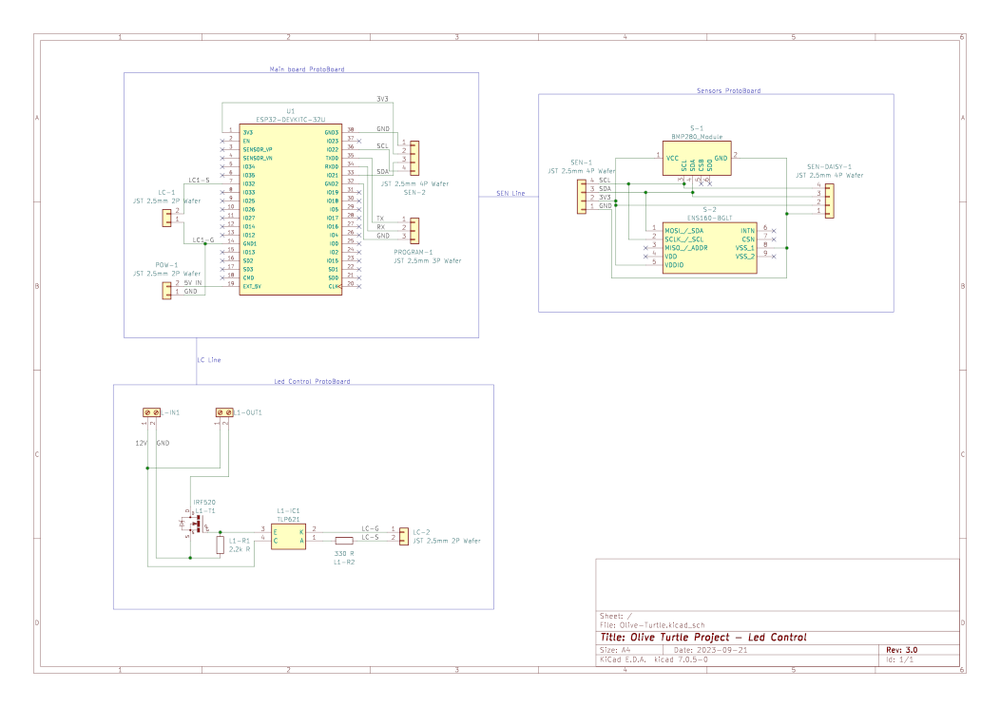

- [1. Olive-Turtle](#1-olive-turtle)
- [2. Final Result](#2-final-result)
- [3. Required components and software](#3-required-components-and-software)
	- [3.1. Home Assistant](#31-home-assistant)
		- [3.1.1. Hardware](#311-hardware)
		- [3.1.2. Software](#312-software)
	- [3.2. MicroController](#32-microcontroller)
		- [3.2.1. Hardware](#321-hardware)
		- [3.2.2. Software](#322-software)
- [4. Installation and wiring](#4-installation-and-wiring)
	- [4.1. Home Assistant](#41-home-assistant)
	- [4.2. Microcontroller](#42-microcontroller)
		- [Wiring](#wiring)

# 1. Olive-Turtle

 Turtle as a logo, no background, realistic")

Olive Turtle is a project developed for the "Laboratory of Making" course (2022/2023) taught by Professor Renzo Davoli and Professor Federico Montori at the University of Bologna.

The project aims to implement a board capable of controlling a 12V LED strip with brightness control and environmental data acquisition.

Everything is controlled using Home Assistant, an open source software written in Python and released in 2013 under the Apache 2.0 license. It is a complete home automation system that can integreate with most existing IoT and home automation devices (mainly thanks to the huge user base) and be used to control and automate all the devices in your home, including custom made microcontroller boards.

# 2. Final Result
TODO

# 3. Required components and software

## 3.1. Home Assistant
### 3.1.1. Hardware
- Raspberry PI 3 (or newer). Note that Home Assistant specifically says that PI 3 is borderline supported due to the limited resources, but it works fine for this project.
### 3.1.2. Software
- [Home Assistant](https://www.home-assistant.io/installation/)
- [Raspberry PI Imager](https://www.raspberrypi.org/software/)

## 3.2. MicroController
### 3.2.1. Hardware
- ESP32 (or any other microcontroller capable of WiFi communication)
- Sensors
  - BMP280
  - ENS160+AHT2x
- LED Control
  - IRF520N MOSFET
  - TLP621 Optocoupler
  - Various resistors
- LED strip with 12V power supply
### 3.2.2. Software
- [Python3](https://www.python.org/downloads/)
- [PlatformIO](https://platformio.org/platformio-ide)
- [ESPHome CLI](https://esphome.io/guides/getting_started_command_line.html)

# 4. Installation and wiring
## 4.1. Home Assistant
If you are using Home Assistant, installation is pretty straight forward, in PI Imager OS selection choose _other specific-purpose OS_, then _Home Assistant and Home Automation_ and finally _Home Assistant_, configure Wireless (If needed) and flash the image on the SD card.

Home Assistant will be available after a couple of minutes at `http://homeassistant.local:8123` (or `http://<ip_address>:8123` if you don't have mDNS enabled on your network).

> Home Assistant is a very complex software, and it's not the focus of this guide, so I won't go into details on how to configure it, but you can find a lot of guides on the internet.

Once installed, you can install ESPHome from the Home Assistant Add-on Store, and then you can start configuring your ESP32 board:
1. Go to the ESPHome tab in Home Assistant sidebar
2. Click on the + button in the bottom right corner
3. Give the board a name
4. Select the board type (ESP32)

ESPHome will generate a configuration file for you and prepare everything for the first upload.

> Note that theoretically the microcontroller setup could be done entirely from this page but it is not a viable option in this specific case due to two problems:
> - We have a component not available (yet) in the ESPHome library;
> - In my tests I noticed that Raspberry PI 3 does not have enough power to compile and upload the code to the board (would probavly work with a Raspberry PI 4).

## 4.2. Microcontroller

### Wiring
This repository provides both a wiring diagram and a proposed implementation for splitting the component across multiple breadboards.

