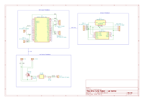

- [1. Olive-Turtle](#1-olive-turtle)
- [2. Final Result](#2-final-result)
	- [2.1. Dashboard](#21-dashboard)
	- [2.2. Debug Dashboard](#22-debug-dashboard)
- [3. Required components and software](#3-required-components-and-software)
	- [3.1. Home Assistant](#31-home-assistant)
		- [3.1.1. Hardware](#311-hardware)
		- [3.1.2. Software](#312-software)
	- [3.2. MicroController](#32-microcontroller)
		- [3.2.1. Hardware](#321-hardware)
		- [3.2.2. Software](#322-software)
- [4. Installation and wiring](#4-installation-and-wiring)
	- [4.1. Home Assistant](#41-home-assistant)
	- [4.2. Microcontroller](#42-microcontroller)
		- [4.2.1. Wiring](#421-wiring)
		- [4.2.2. Software](#422-software)
			- [4.2.2.1. Test Software](#4221-test-software)
			- [4.2.2.2. ESPHome integration](#4222-esphome-integration)
- [5. Telegram Bot](#5-telegram-bot)
	- [5.1. Bot Configuration](#51-bot-configuration)
	- [5.2. Commands](#52-commands)
- [6. Future Development](#6-future-development)
	- [6.1. Hardware Side](#61-hardware-side)
	- [6.2. Software Side](#62-software-side)

# 1. Olive-Turtle

 Turtle as a logo, no background, realistic")

Olive Turtle is a project developed for the "Laboratory of Making" course (2022/2023) taught by Professor Renzo Davoli and Professor Federico Montori at the University of Bologna.

The project aims to implement a board capable of controlling a 12V LED strip with brightness control and environmental data acquisition.

Everything is controlled using Home Assistant, an open source software written in Python and released in 2013 under the Apache 2.0 license. It is a complete home automation system that can integreate with most existing IoT and home automation devices (mainly thanks to the huge user base) and be used to control and automate all the devices in your home, including custom made microcontroller boards.

# 2. Final Result

## 2.1. Dashboard

> Note that due to technical problems with the sensors air quality values are not available in this screenshot.

The resulting dashboard integrates the existing "smart lights" (Ikea TRADFRI) and the Olive Turtle board, which is used to control the LED strip and acquire environmental data.

The board allows for a quick glance at the system status or a more detailed view of the data, and it can be used to control the LED strip brightness.

## 2.2. Debug Dashboard

In the debug section you can see raw data from the board along with some debug parameters like WiFi signal strength.

# 3. Required components and software

## 3.1. Home Assistant
### 3.1.1. Hardware
- Raspberry PI 3 (or newer). Note that Home Assistant specifically says that PI 3 is borderline supported due to the limited resources, but it works fine for this project.
### 3.1.2. Software
- [Home Assistant](https://www.home-assistant.io/installation/)
- [Raspberry PI Imager](https://www.raspberrypi.org/software/)

## 3.2. MicroController
### 3.2.1. Hardware
- ESP32 (or any other microcontroller capable of WiFi communication)
- Sensors
  - BMP280
  - ENS160+AHT2x
- LED Control
  - IRF520N MOSFET
  - TLP621 Optocoupler
  - Various resistors
- LED strip with 12V power supply
### 3.2.2. Software
- [Python3](https://www.python.org/downloads/)
- [PlatformIO](https://platformio.org/platformio-ide)
- [ESPHome CLI](https://esphome.io/guides/getting_started_command_line.html)

# 4. Installation and wiring
## 4.1. Home Assistant
If you are using Home Assistant, installation is pretty straight forward, in PI Imager OS selection choose _other specific-purpose OS_, then _Home Assistant and Home Automation_ and finally _Home Assistant_, configure Wireless (If needed) and flash the image on the SD card.

Home Assistant will be available after a couple of minutes at `http://homeassistant.local:8123` (or `http://<ip_address>:8123` if you don't have mDNS enabled on your network).

> Home Assistant is a very complex software, and it's not the focus of this guide, so I won't go into details on how to configure it, but you can find a lot of guides on the internet.

Once installed, you can install ESPHome from the Home Assistant Add-on Store, and then you can start configuring your ESP32 board:
1. Go to the ESPHome tab in Home Assistant sidebar
2. Click on the + button in the bottom right corner
3. Give the board a name
4. Select the board type (ESP32)

ESPHome will generate a configuration file for you and prepare everything for the first upload.

> Note that theoretically the microcontroller setup could be done entirely from this page but it is not a viable option in this specific case due to two problems:
> - We have a component not available (yet) in the ESPHome library;
> - In my tests I noticed that Raspberry PI 3 does not have enough power to compile and upload the code to the board (would probavly work with a Raspberry PI 4).


## 4.2. Microcontroller

### 4.2.1. Wiring
This repository provides both a wiring diagram and a proposed implementation for splitting the component across multiple protoboards.

The `schematics` folder contains the KiCAD project for the wiring diagram and the VeroRoute project for the protoboard implementation. The wiring is consistent between the two projects.



The wiring diagram is split in three sections, the first one contains the microcontroller and relative connections, the second the sensors and I2C connections to the controller and the third the LED strip and relative connections.

This is the proposed implementation for the protoboard, all sensor identification codes refer to the one used in the KiCAD schematic:
> Note that all images have a mirrored version, so that you can use them as a reference when soldering the components on the back of the board. This version can be found in the `schematics/Olive-Turtle_VeroRoute/png` folder.

**Main Board**


**Sensor Board**


**LED Board**


### 4.2.2. Software

#### 4.2.2.1. Test Software
The `Olive-Turtle_manual_control` folder contains a simple test software that can be used to verify that all the components are working correctly.

Make sure to have PlatformIO installed and open the project folder, then using the PlatformIO UI you can compile and upload the code to the board.

This version of the software does not have any WiFi or Home Assistant integration, it simply reads the sensors and allows you to control the LED strip using the serial monitor.
After setup complete this is the list of available commands:
- `help`: Print the list of available commands
- `led <value>`: Set the LED brightness to the specified value (0-255)
- `led`: Print the current LED brightness
- `aht` | `bmp` | `ens`: Print the current value of the specified sensor
- `all`: Print the current value of all the sensors

After verifying that all sensors provide correct values and that the LED strip is working, you can proceed to the next step and configure the board to work with Home Assistant.

> Note that the test software is not required for the next step, it is only provided as a way to verify that all the components are working correctly.

#### 4.2.2.2. ESPHome integration

This is the final step, we will now configure the board to work with Home Assistant.

Open the `Olive-Turtle_esphome` folder, rename (or copy) the secretsTemplate.yaml to secrets.yaml and fill in the required information.
One of the fields will be `homeassistant_key`, this key can be found in Home Assistant, in the ESPHome tab by clicking on the three dots next to the board name and then on _Show API Key.

Once you have filled in all the required information, you can compile and upload the code to the board with `esphome run Olive-Turtle.yaml`.
> Note that the first upload MUST be done using a USB cable, after the first upload you can use OTA updates.

If everything went correctly you should see the board as online in Home Assistant. Next go to settings and add the board as a device. The board will be automatically added to the auto generated dashboard and you can now control the LED strip and see the sensor values.

# 5. Telegram Bot
As a proof of concept I tried implementing a Telegram Bot ([@OliveTurtleBot](https://t.me/OliveTurtleBot)) using the Telegram extension of Home Assistant.

The bot is very simple, it allows you to activate two predefined scenes, __away__ and __nightpc__, but can also be used to get notifications from other Home Assitant automations.

Unfortunately the Telegram extension does not have a UI setup process, so you have to manually edit the configuration file, but it is not very complicated and is explained in the [official documentation](https://www.home-assistant.io/integrations/telegram).

## 5.1. Bot Configuration
The first step is to edit `/config/configuration.yaml` and add the following lines while replacing the placeholders (elements between [[  ]] ) with your data:
```yaml
# Telegram Bot
telegram_bot:
  - platform: polling
    api_key: "[[ API KEY ]]"
    allowed_chat_ids:
      - [[ CHAT ID ]]

# Notifier
notify:
  - platform: telegram
    name: "[[ NAME ]]" # This can be anything you want, will be used internally when calling in automations
    chat_id: [[ CHAT ID]]
```

By adding this to configuration we set up two things:

1. We enable the Telegram Bot extension and configure it to use polling (instead of webhooks) and we specify the API key (provided by [@BotFather](https://t.me/BotFather)) and the chat ID (if you don't know your chat id, use [@getidsbot](https://t.me/getidsbot)).
2. We set up a notify action that we can use in our automations. This will allow us to send messages from the bot to a specific user (as per telegram rules, the user MUST have started the bot first).

After this we need to reload Home Assistant YAML, we can do so from the YAML tab by pressing restart and quick restart.

To test notifications you can use the developer tools in Home Assistant, go to the services tab and select `notify.[[ NAME ]]` from the dropdown menu, then fill in the message and click on call service. You should receive a message from the bot.

Now the bot is able to send messages to the user but it ignores everything received from the user.

## 5.2. Commands
The bot is able to receive commands from the user, but it needs to know what to do with them. To do this we need to add a new automation.

For the sake of this documentation, we will only implement the __ping__ command since th implementation is the same for all the other commands.

Despite what the [official documentation](https://www.home-assistant.io/integrations/telegram_bot/#event-triggering) says, it's easier to configure this from the UI rather than from the automation file.
To do so, go to settings and then to automations, click on the + button, create new automation and select the following options:
- As trigger select a manual trigger
  - insert `telegram_command` as event type
  - insert `command: /ping` as event data
- As action select call service
  - select `Notifications: Send a notification with [[name]]`
  - as message write `pong`

Click save in the bottom right corner and give it a name, once this is done you can test the command by sending `/ping` to the bot.

If you want the bot to suggest available commands you can manually set them using [@BotFather](https://t.me/BotFather).

To make a command that activates a scene you just have to add a second action in your automation and select scene as you can see in the following image:


# 6. Future Development
## 6.1. Hardware Side
- [ ] https://github.com/ale-ben/Olive-Turtle/issues/4 Fix Air quality sensor or identify valid alternative
- [ ] Prototype and print first PCB version
## 6.2. Software Side
- [ ] As soon as https://github.com/esphome/esphome/pull/4243 is merged, remove custom ENS160 implementation and use library instead
  - Removing the custom implementation would also allow to upload directly from Home Assistant (with a more powerful server) therefore removing entirely the need for ESPHome CLI
- [X] Implement InfluxDB as long term sensor data storage
- [ ] Implement Grafana as a dashboard alternative
