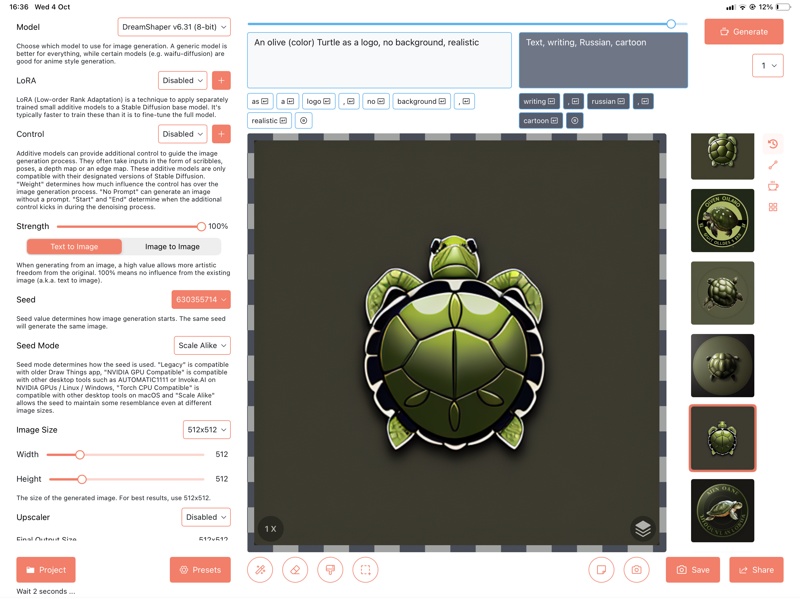
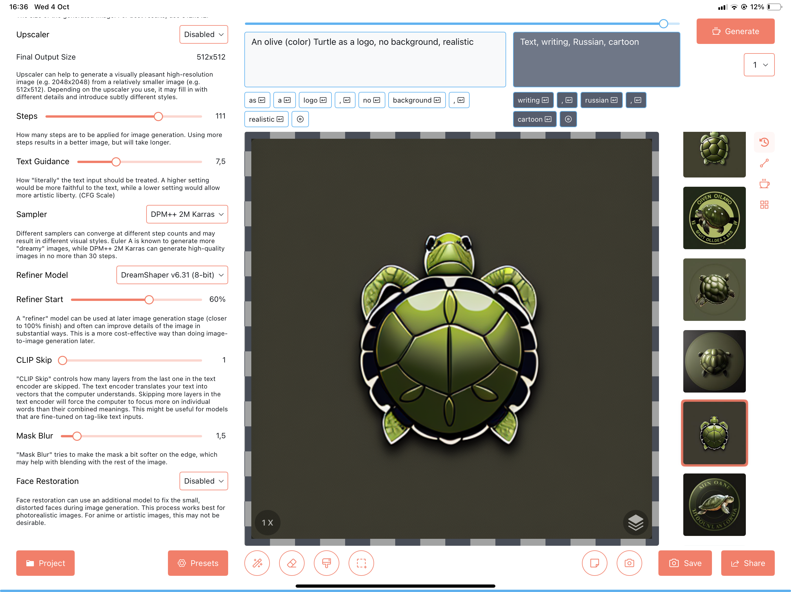
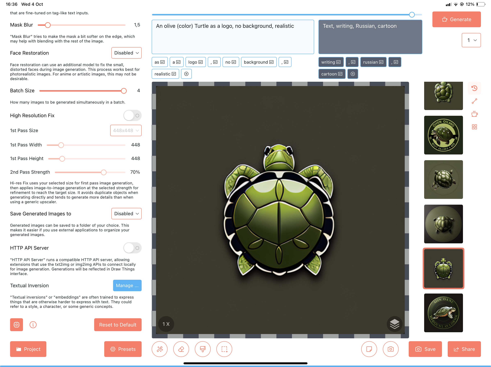

This logo has been generated using _DreamShaper v6.31 (8-bit)_ and the following prompt:
> An olive (color) Turtle as a logo, no background, realistic

The following negative keywords have been used:
> Text, writing, Russian, cartoon

The image has been generated on a tablet using [Draw Things](https://drawthings.ai) ant the following parameters:

